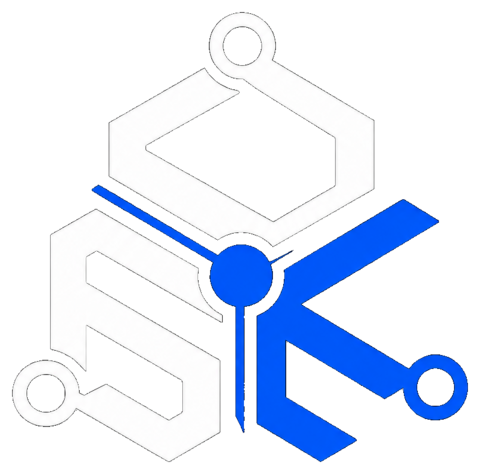

# DSK Nexus

**Independent software company building digital products that solve real problems.**

---

## About

DSK Nexus is an independent software company focused on building practical digital products designed around real-world needs.

We create software that improves access to information, opportunities, and digital experiences for communities.

Our approach is simple: identify problems, build useful solutions, and create products that make a meaningful impact.

---

## Products

### MatricBase 🇿🇦

MatricBase is an education platform helping South African Grade 12 learners navigate their future after high school.

The platform provides:

- University requirements
- Application guidance
- APS calculations
- Past papers and study resources
- Bursary opportunities
- Career information

Website: https://matricbase.co.za

---

## Founder

**Siyanda Nonkala**  
Founder, DSK Nexus

Software builder and product creator focused on turning ideas into useful digital products.

---

## Technology

Building with:

- Web technologies
- Mobile applications
- Cloud platforms
- Modern software tools

---

## Vision

To build digital products that solve meaningful problems and create better experiences for people.

---

## Links

🌐 Website: https://dsknexus.co.za

📧 Email: contact.dsknexus@gmail.com

📱 Social:
- Instagram: @dsknexus
- Facebook: DSK Nexus

---

© DSK Nexus
